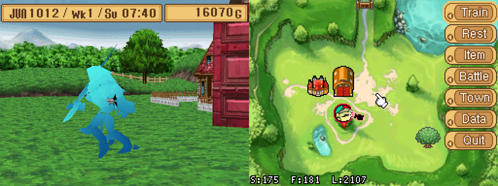
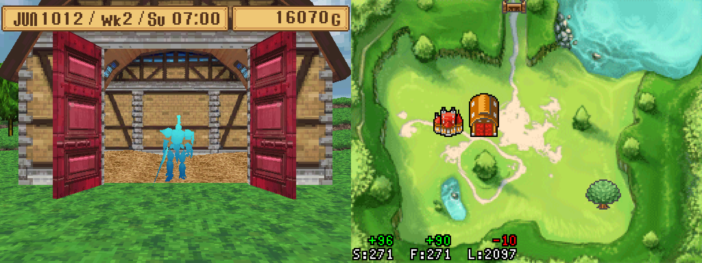

# mrds_overlay
DeSmuME overlay for the game Monster Rancher DS that displays hidden game info.

## Features
* Displays your monster's stress, fatigue, and lifespan.
* Shows changes to your monster's stress, fatigue, and lifespan.

## Usage
To setup and use the overlay, follow the instructions below:

### First time setup
1. Download and install DeSmuME if you do not already have it installed
2. Check whether your installation of DeSmuME is 32-bit (x86) or 64-bit (x86-64)
3. Download the Lua 5.1 DLL that matches the architecture of your copy of DeSmuME (32-bit or 64-bit)
    * Download from: https://sourceforge.net/projects/luabinaries/files/5.1.5/Windows%20Libraries/Dynamic/
    * 32-bit / x86: `lua-5.1.5_Win32_dll14_lib.zip`
    * 64-bit / x86-64: `lua-5.1.5_Win64_dll14_lib.zip`
4. Extract the `lua5.1.dll` file from the zip file you downloaded
5. Move `lua5.1.dll` to the same folder where your DeSmuME executable is
6. Rename `lua5.1.dll` to `lua51.dll`
7. Download the `overlay.lua` script for the latest release at the following link:
    * https://github.com/ExcaliburZero/mrds_overlay/releases
    * Under the `Assets` header, click on the `overlay.lua` link to download file
8. Run DeSmuME and start the ROM for the game
9. In the menu bar, click on `Tools > Lua Scripting > New Lua Script Window...`
10. Click the `Browse...` button and select the `overlay.lua` file your downloaded

### Each subsequent usage
1. Run DeSmuME and start the ROM for the game
2. In the menu bar, click on `Tools > Lua Scripting > overlay.lua`

## FAQs
### Running the overlay makes the game slow down / lag. How can I fix this?
If you are running DeSmuMe with a GPU Scaling Factor of 3 or higher (in `Config > 3D Settings`) the game might slow down or lag on some game screens.

Currently the only workaround I know for this is to set the GPU Scaling Factor to 2 or 1 and then restart DeSmuME.

## Related links
* [mrds_extract](https://github.com/ExcaliburZero/mrds_extract) - Set of tools for extracting data from and working with save data for Monster Rancher DS. 
* [FCEUX Lua API docs](https://fceux.com/web/help/LuaScripting.html) - Documentation for the Lua scripting API that DeSmuME provides.